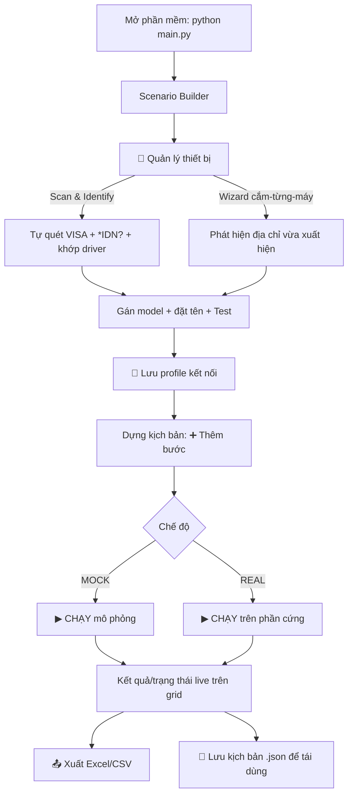

# Luồng Thao tác Người dùng (User Action Flow)

Quy trình kỹ thuật viên thực hiện trên phần mềm với kiến trúc **Scenario Builder
(grid step-by-step, đa thiết bị)**. Áp dụng cho mọi nhóm máy đếm tần số và máy đo
công suất trong `DEVICE_REGISTRY`.

> Luồng file `.txt` + dashboard SMW200A/CNT-90XL cũ đã được loại bỏ.

---

## 1. Sơ đồ tổng quát

---

## 2. Chi tiết các bước

### Bước 1 — Gán địa chỉ thiết bị (Device Manager)

Mục tiêu: người không chuyên **không phải gõ tay** địa chỉ VISA.

- Mở **🔌 Quản lý thiết bị**.
- **🔍 Scan & Identify**: phần mềm quét mọi địa chỉ VISA, tự gửi `*IDN?` và **tự
  khớp** model. Bảng hiện: địa chỉ · IDN · nhận diện · ô gán model · serial.
- **🔌 Wizard cắm-từng-máy** (cho máy đời cũ không có `*IDN?`, hoặc 2 máy trùng
  model): làm theo hướng dẫn cắm **một** máy → phần mềm phát hiện địa chỉ vừa xuất
  hiện → bạn chọn model + đặt tên.
- **🧪 Test** từng dòng để xác nhận kết nối (✅/❌).
- **💾 Lưu profile** ra `connection_profile.json` (lần sau **📂 Nạp profile** dùng
  lại). Bấm **✔ Áp dụng** để dùng cho chế độ REAL.

### Bước 2 — Dựng kịch bản (grid)

- **➕ Thêm bước**: chọn **1 hoặc nhiều thiết bị**, chọn **hành động** (combo tự lọc
  theo nhóm thiết bị), nhập **tham số**, ghi chú.
- **✏ Sửa** (hoặc double-click), **⧉ Nhân bản**, **🗑 Xóa**, **▲▼** đổi thứ tự.
- Cột "Bật" cho phép tạm tắt một bước mà không xóa.

Hành động khả dụng:
- Máy đếm: `Đặt gate time`, `Đo tần số`.
- Máy công suất: `Đặt tần số (cal factor)`, `Zero đầu đo`, `Đo công suất`.
- Mọi máy: `Nhận diện (*IDN?)`, `Đọc trạng thái`.
- Không cần thiết bị: `Chờ ổn định (wait)`.

### Bước 3 — Chạy

- Tích/bỏ tích **MOCK**:
  - **MOCK**: chạy mô phỏng, không cần phần cứng (giá trị giả lập).
  - **REAL**: dùng `address_map` từ profile; nếu thiếu địa chỉ cho thiết bị nào,
    phần mềm chặn và nhắc mở Device Manager.
- **▶ CHẠY**: kết quả từng (bước, thiết bị) cập nhật **live** vào cột Kết quả/Trạng
  thái; log chi tiết ở khung dưới. **■ DỪNG** để hủy giữa chừng.

### Bước 4 — Xuất & tái dùng

- **📤 Xuất kết quả** → `.xlsx` (có tô màu OK/LỖI) hoặc `.csv`.
- **💾 Lưu** kịch bản ra `.json`; **📂 Mở** để tái sử dụng nhiều lần.

---

## 3. Xử lý ngoại lệ

- **Không tìm thấy thiết bị khi scan**: kiểm tra cáp/nguồn, đã cài NI-VISA chưa
  (xem [INSTALL.md](../INSTALL.md)); dùng Wizard cho máy không tự khai báo.
- **Sai tham số / action không hợp nhóm**: `validate` chặn trước khi chạy và liệt
  kê lỗi.
- **Lỗi khi chạy một bước**: bước đó báo **LỖI** (đỏ) kèm thông báo, các bước khác
  vẫn tiếp tục; thiết bị được đóng an toàn khi kết thúc.
- **Máy đời cũ (Advantest R5372P, Boonton 4231A, PM6680)**: lệnh là *best-effort*,
  cần đối chiếu manual và chỉnh hằng `CMD_*` trong driver khi chạy máy thật.
